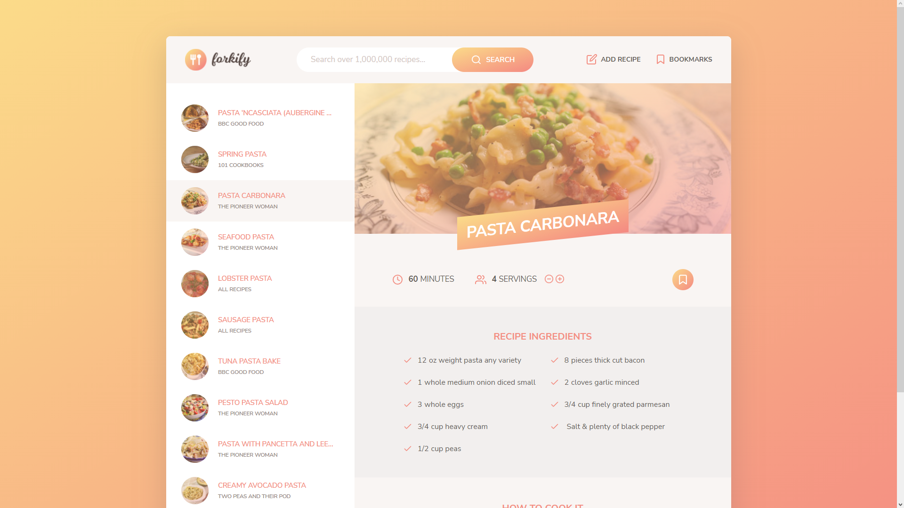

# Aplicação para buscar e criar receitas.

Essa aplicação foi o projeto final desenvolvido no curso [The Complete JavaScript Course 2022: From Zero to Expert!
](https://www.udemy.com/course/the-complete-javascript-course/)

## FAQ

### 1) O que aprendi durante o curso ?

Fundamentos do javascript, manipulação de eventos DOM, Funções, Arrays (forEach, map, filter, reduce, find, findIndex, some, flatMap, ...), OOP (Prototypes, Class, Setters and Getters, Manipulação de objetos), Manipulação de Data, Intl, Timers e Geolocalização, Consumo de Bibliotecas externas, Promises, Async/Await e AJAX, consumo e manipulação de API, ES6 (Desestruturação, Spread Operator, Arrow Functions, Modulos, Class, Fetch ).

### 2) No que consiste a aplicação ?

Buscar receitas através de um API e manipular os dados para exibir as receitas, seus ingredientes e forma de preparo, além de possibilitar o usuário a salvar suas receitas favoritas, como também criar novas receitas. Tudo isso funcionando através do navegador, salvando as receitas do usuário no localstorage.

### 4) Como usar esse app ?
Na barra de pesquisar você digitar o nome de uma receita (em inglês por conta da API), por exemplo **PIZZA** ou **PASTA**, depois de pesquisado a receita, no canto esquerdo da tela, irá aparecer uma lista das receitas que você buscou, ao clicar em alguma delas, ela será exibida no canto direito da tela, com os ingredientes e dados de preparo, você pode aumentar ou diminuir o número de pessoas para a receita, com isso os ingredientes serão atualizados automaticamente.

Outra funcionalidade da aplicação é criar sua própria receita, no canto superior direito ao clicar no botão escrito **ADD RECIPE** aparecer um formulário para ser preenchido com dados da receita. Depois de tudo preenchido, basta clicar no botão **UPLOAD**, esperar a mensagem de confirmação e sair do formulário clicando no **X**.

Por fim, você pode adicionar receitas aos seus marcadores, ao clicar no botão superior direito escrito **BOOKMARKS** ou então no botão abaixo do nome da receita que você selecionou

### 3) Como rodar a aplicação ?

Tendo o npm instalado em sua máquina, basta rodar o comando npm install para instalar todas as dependências da aplicação. 
Depois use o comando npm start, para iniciar um servidor local para exibir a aplicação no seu navegador.

### 4) Posso usar esse projeto ?

Como instruído no curso, esse é um projeto somente para fins de portfólio. **Não é permitido** usar esse projeto para cursos/vídeos/artigos.

